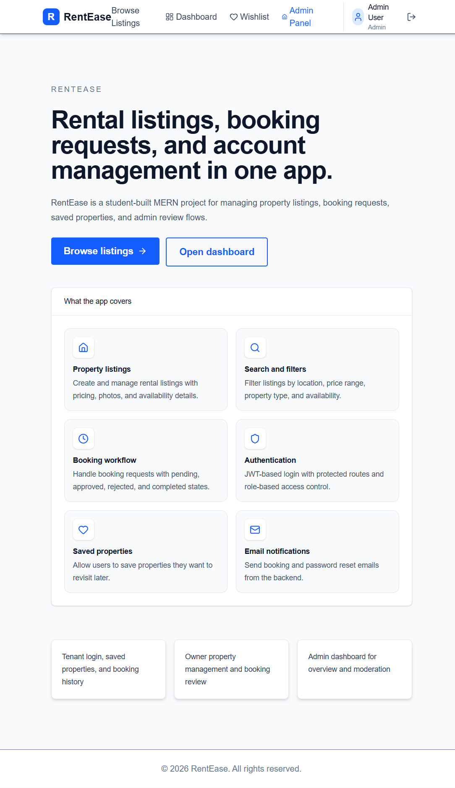
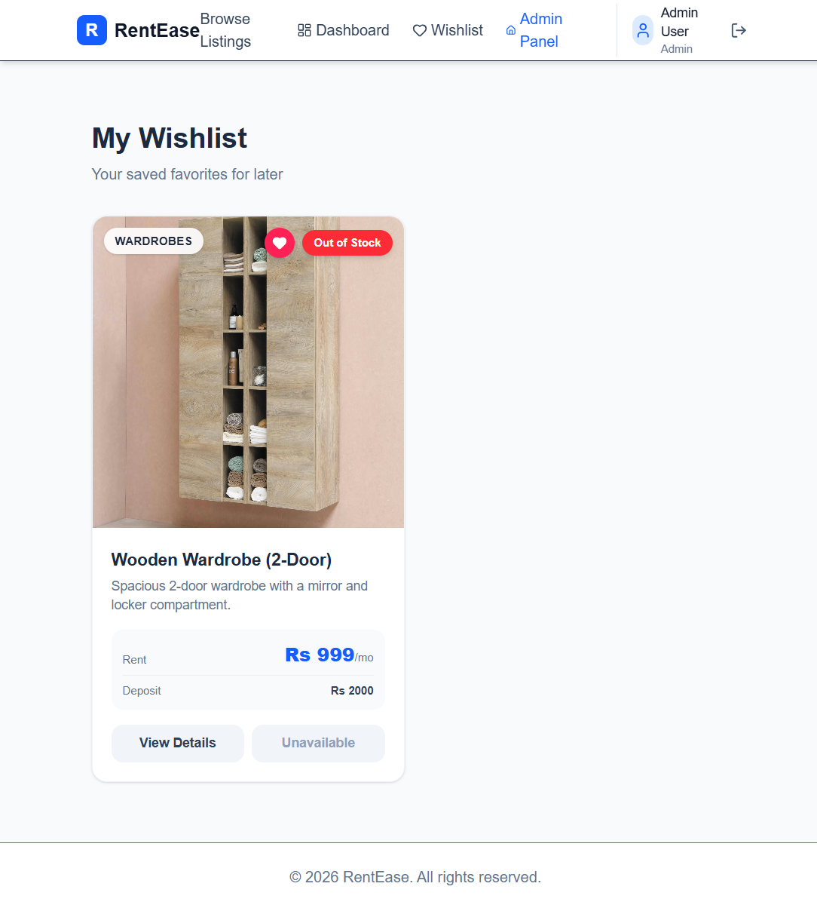
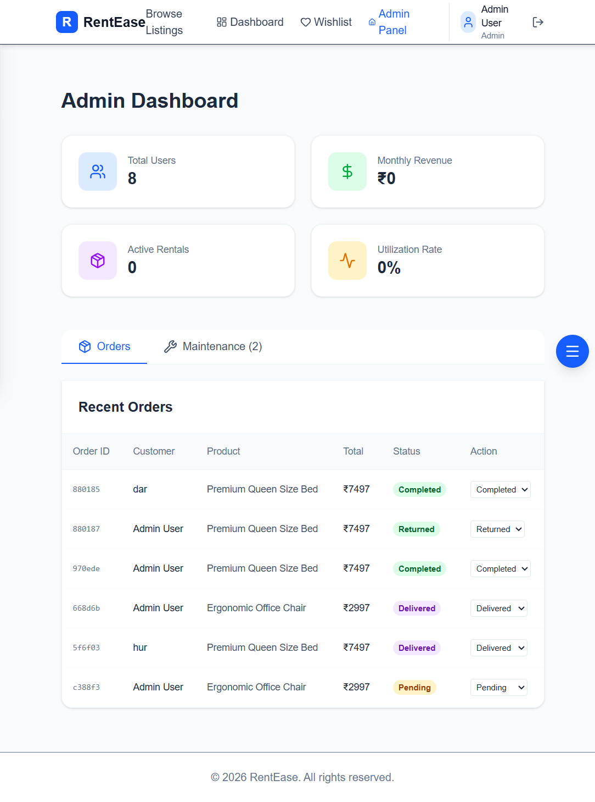
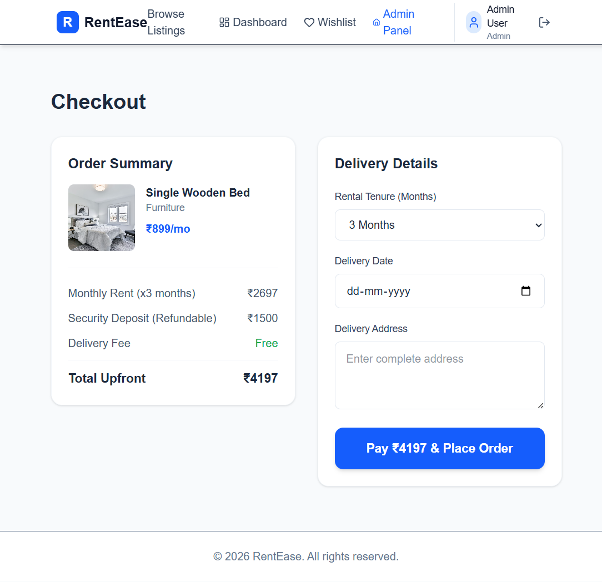

# RentEase – Full Stack Rental Management Platform


RentEase is a responsive MERN-stack platform for browsing rental listings, managing saved items, placing orders, and handling admin workflows. The project emphasizes secure JWT-based authentication, maintainable architecture, and a polished UI built with React, Tailwind CSS, Express, and MongoDB.

---

## 🔗 Repository
- **GitHub:** [Darshashetty/rentease-rental-platform](https://github.com/Darshashetty/rentease-rental-platform)

---

## 🚀 Key Highlights

* **JWT Authentication & Role-Based Access**
* **Server-Side Pagination & Debounced Search**
* **Wishlist & Order Lifecycle Management**
* **Recently Viewed (client-side)**
* **Product Image Uploads with Multer**
* **Automated Email Notifications with Nodemailer**
* **Responsive MERN Stack Architecture**

---

## ✨ Features

- **JWT Authentication:** Secure sessions with password hashing and protected routes.
- **Protected Routes:** Frontend route guards for authenticated and admin-only pages.
- **Role-Based Admin Access:** Dedicated admin dashboards and management views.
- **Product Search & Filters:** Dynamic filtering by name, category, availability, and sort order.
- **Debounced Search:** Reduced request noise while typing in the product search bar.
- **Recently Viewed:** Client-side localStorage tracking for quick return to recently inspected items.
- **Server-Side Pagination:** Efficient product retrieval with MongoDB `skip()` and `limit()`.
- **Wishlist/Favorites:** Logged-in users can save and manage products for later.
- **Product Image Uploads:** Admin image handling through Multer-backed upload endpoints.
- **Order Placement:** Clear checkout flow with persisted order records.
- **Order Status Tracking:** Admins manage order transitions with backend validation.
- **Nodemailer Email Notifications:** Automated email delivery for user-facing events.
- **Polished UI Components:** Clean, responsive product cards, wishlist, and admin views for recruiter presentations.
- **Responsive UI:** Mobile-friendly layouts built with Tailwind CSS.
- **Toast Notifications:** Lightweight feedback for success and error states.

---

## 🛠 Tech Stack

**Frontend**
- React.js
- Vite
- Tailwind CSS
- Axios (Centralized Instance)
- React Router

**Backend**
- Node.js
- Express.js
- MongoDB & Mongoose
- JSON Web Tokens (JWT)
- Multer (File Handling)
- Nodemailer (SMTP Emails)

---

## 📂 Folder Structure

```text
rentease-rental-platform/
├── backend/
│   ├── config/          # DB connection logic
│   ├── middleware/      # Auth, Multer, Error handlers
│   ├── models/          # Mongoose schemas (User, Product, Order)
│   ├── routes/          # Express API endpoints
│   ├── utils/           # Nodemailer and helper scripts
│   ├── uploads/         # Locally stored images
│   └── index.js         # Entry point
└── frontend/
    ├── src/
      │   ├── components/  # Reusable UI (Cards, Loaders, Navbar)
      │   │   └── RecentlyViewed.jsx # lightweight recently viewed UI
    │   ├── context/     # AuthContext and Axios global config
    │   ├── hooks/       # Custom React Hooks
    │   └── pages/       # Route-level views (Dashboard, ProductList)
    └── index.html
```

---

## 📸 Screenshots

### Home Page


### Product Listing & Filters


### User Wishlist


### Admin Dashboard


### Checkout / Orders Page


### Mobile Responsive View


---

## 💻 Installation & Setup

1. **Clone the repository:**
   ```bash
   git clone https://github.com/Darshashetty/rentease-rental-platform.git
   cd rentease-rental-platform
   ```

2. **Install Backend Dependencies:**
   ```bash
   cd backend
   npm install
   ```

3. **Install Frontend Dependencies:**
   ```bash
   cd ../frontend
   npm install
   ```

4. **Configure Environment Variables:**
   - Create a `.env` file in the `/backend` folder.
   - Create a `.env` file in the `/frontend` folder.
   *(See the Environment Variables section below for configuration)*

5. **Run Backend (Terminal 1):**
   ```bash
   cd backend
   npm run dev
   ```

6. **Run Frontend (Terminal 2):**
   ```bash
   cd frontend
   npm run dev
   ```

---

## 🔐 Environment Variables

### Backend (`backend/.env`)
```env
PORT=5000
MONGO_URI=mongodb+srv://<username>:<password>@cluster.mongodb.net/rentease?retryWrites=true&w=majority
JWT_SECRET=your_super_secret_jwt_key
EMAIL_USER=your_email@gmail.com
EMAIL_PASS=your_app_specific_password
CLIENT_URL=http://localhost:5173
```

### Frontend (`frontend/.env`)
```env
VITE_API_URL=http://localhost:5000/api
VITE_APP_NAME=RentEase
```

---

## 🔌 API Features Overview

- **Centralized Axios Handling:** All HTTP requests use a globally configured Axios instance that intercepts requests to inject JWT Bearer tokens automatically.
- **Protected APIs:** Sensitive backend endpoints use custom middleware to verify token signatures.
- **Pagination Queries:** The product search endpoint utilizes MongoDB `skip()` and `limit()` combined with Regex for efficient querying.
- **Upload Handling:** The image endpoint intercepts multipart-form data using Multer, sanitizes filenames, and stores them in the static `uploads/` directory.

---

## 🌍 Deployment

- **Frontend:** Configure any SPA host that supports client-side routing.
- **Backend:** Deploy to any Node.js host that supports environment variables and CORS configuration.
- **Database:** Works with MongoDB Atlas or a local MongoDB instance.

---

## 💼 What This Project Demonstrates

- **Full-Stack Development:** Integrating a modern React UI with a Node.js backend.
- **Authentication Systems:** Implementing secure JWT-based authentication.
- **REST API Design:** Structuring maintainable and stateless HTTP endpoints.
- **Responsive UI Engineering:** Building mobile-first layouts with loading and empty states.
- **Backend Architecture:** Separating concerns with routes, middleware, and models.
- **Real-World Workflows:** Handling dynamic search, file uploads, and transactional emails.

---

## 🔑 Access Notes

*Access details are available upon request.*

---

## 🔜 Future Improvements

- Payment gateway integration (e.g., Stripe)
- Cloud image storage migration
- Interactive booking calendar
- Analytics dashboard visualization